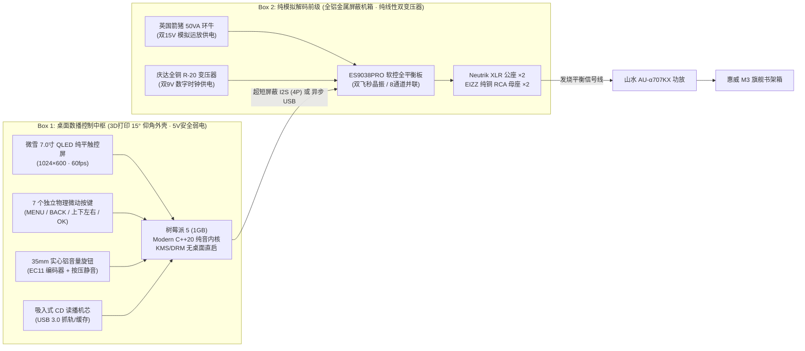

# 🎵 MyHiFiPlayer - 发烧级桌面数播解码前级一体机 (分体式旗舰架构)

本项目是由用户深度定制的 **发烧级桌面分体式纯音数播解码前级系统**。全系统采用 **树莓派 5 代 (1GB)** 作为数字交互中枢，基于 **Modern C++20** 原生自研纯音播放器核心，开机 3.8 秒直入 **60fps 经典麦景图（McIntosh）湖蓝色动圈双表头** 交互界面，硬件级 Bit-Perfect 零抖动直出至 **ES9038PRO 旗舰全平衡解码前级**，驱动 **山水 AU-α707KX 功放** 与 **惠威 M3 旗舰书架箱**。

---

## 🤖 AI 会话恢复协议 (Agent Session Recovery Protocol)

> [!IMPORTANT]
> **新会话接入必读**：如果你是新唤醒或刚接手本项目的 AI 编码助手，**请先通读本文档以及 `doc/index.html`**！
> 
> 本文档是整个项目的 **单一真实数据源（Single Source of Truth）**。所有关键选型、电气拓扑、避坑经验、代码框架与引脚定义已全部严密论证，**严禁推翻已敲定的核心设计**：
> 
> 1. **分体式分身架构（Split-Chassis）**：
>    * **Box 1: 数播控制中枢（桌面端）**：树莓派 5 + 微雪 7 寸 QLED 纯平触控屏 + 35mm 实心铝旋钮 (EC11) + **7 个独立金属物理按键** + 选配吸入式 CD。**采用 3D 打印 15° 黄金仰角独立外壳**，全机仅 5V 安全弱电（Type-C 供电），彻底隔绝强电触碰风险与高频杂讯。
>    * **Box 2: 纯模拟解码前级（后级端）**：ES9038PRO 软控平衡板 + 英国箭猪 50VA 环牛 (双15V 模拟) + 庆达全铜 R-20 变压器 (双9V 数字时钟) + 万可免焊端子。**采用独立全铝纤薄金属机箱**（全金属屏蔽 220V 市电与电磁辐射，声底黑如深空）。
> 2. **结对编程原则（用户为主驾驶，AI 为领航员）**：
>    * 用户通过此项目**精进练习 Modern C++20 编程能力**！
>    * **AI 严禁一次性替用户写完所有业务代码**。AI 的职责是：**拆解关卡、提供设计思路、讲解核心原理与标准库算法、提供关键代码骨架、对用户写的代码进行严格 Code Review（检查内存泄露、越界、线程安全与现代语法）**，由用户亲手敲出代码并调试！
> 3. **全链路 0dB 纯静音原则**：整机禁止任何机械散热风扇！树莓派 5 官方散热器拔掉风扇引线，利用纯铝自然对流（播放功耗仅 4W，温升稳定在 50°C 远低于 85°C 警戒线）。
> 4. **I2S 异步从机直出**：树莓派仅出 3 线制 I2S（BCLK/LRCLK/DOUT）+ 1 根参考地 GND，严禁折腾 MCLK 飞线（ES9038PRO 成品板载双飞秒晶振自同步，彻底隔绝树莓派时钟抖动）。
> 5. **后板工业标准接插件**：解码前级后板平衡输出必须使用 **公座 (Neutrik NC3MD-LX-B)**（3 根插针朝外，针脚指引信号流向）；单端使用 **EIZZ 磷青铜镀金 RCA 母座**（特氟龙耐 300℃ 高温绝缘）。
> 6. **CD 架构原则**：吸入式光驱走 **树莓派 USB 3.0 接口** 实现内存缓冲（RAM Buffer）纠错播放与抓轨，严禁使用老式硬件飞线直连 DAC。
> 7. **统一输入事件总线 (InputManager 抽象解耦)**：
>    * 7 个物理按键与音量旋钮通过 `InputManager` 抽象层解耦。
>    * 在 Mac 开发期通过键盘（方向键、Enter、Esc、M键）与滚轮完美模拟；在树莓派上无缝切换为 `libgpiod` 监听，UI 与音频业务逻辑代码 **零修改**！

---

## 🎧 信号链路与分体式物理架构



---

## ⚡ 树莓派 5 40-Pin 物理排针与硬件接线规范

全机外设仅占用 **10 个 GPIO + 3 个 GND**，共 13 根针脚。**剩余 15 个 GPIO 完全空闲备用**！

```
                          【树莓派 5 物理排针与外设连接布局】

                 (左侧 奇数列引脚)                   (右侧 偶数列引脚)
                                   ┌──────────────┐
                                   │  BCM2712 主控│
                                   │   RP1  I/O   │
                                   └──────────────┘
                                   ┌─[40-PIN 座]──┐
           (悬空备用) 3.3V Power ──┤ Pin 1   Pin 2│── 5V Power (悬空备用)
   MENU 菜单键  Pin 3 (GPIO 2) ───┤ Pin 3   Pin 4│
   BACK 返回键  Pin 5 (GPIO 3) ───┤ Pin 5   Pin 6│── GND (系统地)
     UP 向上键  Pin 7 (GPIO 4) ───┤ Pin 7   Pin 8│
 ★ 7按键公共地  Pin 9 (GND)    ───┤ Pin 9  Pin 10│
   DOWN 向下键  Pin 11 (GPIO 17) ──┤ Pin 11  Pin 12│─────── ➔ I2S BCLK (位时钟) ➔ 接 ES9038PRO
   LEFT 向左键  Pin 13 (GPIO 27) ──┤ Pin 13  Pin 14│
  RIGHT 向右键  Pin 15 (GPIO 22) ──┤ Pin 15  Pin 16│──┐
                                   │ Pin 17  Pin 18│  │  ★【偶数列连续 4 根排针一体直插】
                                   │ Pin 19  Pin 20│  ├─ ➔ EC11 实心铝旋钮 (A/B/GND/按压)
                                   │ Pin 21  Pin 22│──┘
                                   │ Pin 23  Pin 24│
                                   │ Pin 25  Pin 26│
                                   │ Pin 27  Pin 28│
     OK 确认键  Pin 29 (GPIO 5) ───┤ Pin 29  Pin 30│
                                   │ Pin 31  Pin 32│
                                   │ Pin 33  Pin 34│
     ES9038PRO  I2S LRCLK (帧同步) ├── Pin 35  Pin 36│
                                   │ Pin 37  Pin 38│
     ES9038PRO  数字音频参考地 GND ├── Pin 39  Pin 40│─────── ➔ I2S DOUT (数据) ➔ 接 ES9038PRO
                                   └──────────────┘
                                      [USB 3.0] ➔ 直插吸入式 CD 读播抓轨 (0 占 GPIO)
                                     [Micro-HDMI] ➔ 直插 7.0寸 QLED 屏 (0 占 GPIO)
```

### 1. 7 个独立物理按键（全部汇聚在奇数列，带连续 8P 彩排线设计）
* **Pin 3 (GPIO 2)** ➔ **MENU 菜单键**（呼出全局设置 / 切换表头与频谱视觉）
* **Pin 5 (GPIO 3)** ➔ **BACK 返回键**（返回上一级列表 / 关闭弹窗对话框）
* **Pin 7 (GPIO 4)** ➔ **UP 向上键**（曲目列表向上移动高亮选中光标）
* **Pin 9 (GND)**    ➔ **按键公共地线**（**⭐ 7 个按键共用这 1 根地线！**）
* **Pin 11 (GPIO 17)** ➔ **DOWN 向下键**（曲目列表向下移动高亮选中光标）
* **Pin 13 (GPIO 27)** ➔ **LEFT 向左键**（快退 5 秒 / 上一切换 Tab 栏）
* **Pin 15 (GPIO 22)** ➔ **RIGHT 向右键**（快进 5 秒 / 下一切换 Tab 栏）
* **Pin 29 (GPIO 5)**  ➔ **OK 确认键**（确认播放当前选中曲目 / 确认弹窗选项）
* *布线绝妙设计：Pin 3、5、7、9、11、13、15 是连成一体的连续 7 根排针，可使用一根标准 8P 彩色排线母头一体直插，免去零散杜邦线混乱！*

### 2. EC11 35mm 实心铝音量旋钮（偶数列连续 4 针直插）
* **Pin 16 (GPIO 23)** ➔ 旋钮 A 相脉冲信号
* **Pin 18 (GPIO 24)** ➔ 旋钮 B 相脉冲信号
* **Pin 20 (GND)**     ➔ 旋钮公共地线
* **Pin 22 (GPIO 25)** ➔ 旋钮垂直按压微动开关（一键静音 Mute / 播放暂停）
* *布线绝妙设计：Pin 16、18、20、22 恰好为偶数列相邻 4 针，直接用 4P 杜邦排线一体插拔！*

### 3. I2S 纯净数字音频排针（汇聚在右下底角）
* **Pin 12 (GPIO 18)** ➔ **BCK / SCLK**（位时钟）
* **Pin 35 (GPIO 19)** ➔ **LRCK / WS**（左右声道帧同步时钟）
* **Pin 40 (GPIO 21)** ➔ **DATA / DIN**（串行音频数据流）
* **Pin 39 (GND)**     ➔ **GND**（数字音频参考地）

---

## 🎛️ InputManager 跨平台输入抽象总线

为了保证 **Mac 开发自测** 与 **树莓派实机运行** 体验完全一致，采用抽象接口实现输入解耦：

| 交互功能 | Mac 键盘/鼠标映射 (开发期) | 树莓派 5 物理硬件映射 (实机期) | 软件消抖 (Debounce) |
| :--- | :--- | :--- | :--- |
| **MENU (菜单)** | 键盘 `M` 键 | Pin 3 (GPIO 2) 平头微动按键 | 20ms 软件消抖 |
| **BACK (返回)** | 键盘 `Escape` 键 | Pin 5 (GPIO 3) 平头微动按键 | 20ms 软件消抖 |
| **UP (向上)** | 键盘方向键 `↑` | Pin 7 (GPIO 4) 平头微动按键 | 20ms 软件消抖 |
| **DOWN (向下)** | 键盘方向键 `↓` | Pin 11 (GPIO 17) 平头微动按键 | 20ms 软件消抖 |
| **LEFT (向左/快退)** | 键盘方向键 `←` | Pin 13 (GPIO 27) 平头微动按键 | 20ms 软件消抖 |
| **RIGHT (向右/快进)**| 键盘方向键 `→` | Pin 15 (GPIO 22) 平头微动按键 | 20ms 软件消抖 |
| **OK (确认/播放)** | 键盘 `Enter` / `Space` | Pin 29 (GPIO 5) 平头微动按键 | 20ms 软件消抖 |
| **音量增加 (Volume+)**| 鼠标滚轮向上 / 键盘 `+` | EC11 旋钮顺时针旋转 (Pin 16/18) | 正交解码 (Quadrature) |
| **音量减小 (Volume-)**| 鼠标滚轮向下 / 键盘 `-` | EC11 旋钮逆时针旋转 (Pin 16/18) | 正交解码 (Quadrature) |
| **静音/暂停 (Mute)** | 键盘 `Space` / 鼠标中键 | 旋钮垂直按压开关 (Pin 22) | 20ms 软件消抖 |

---

## 📋 硬件 BOM 状态与采购备忘

完整交互式物料卡片与平台直达见：[`doc/index.html`](file:///Users/mk10/Desktop/hifi_player/doc/index.html)

1. **第一阶段（起步自测，立即拍下）：¥803.71**
   * 树莓派 5 代 (1GB) 官方基础套餐（¥502.00，含 5V 5A PD 专用电源、32G TF卡、读卡器、纯铝散热器，拔风扇0dB静音）
   * 微雪 7.0 寸 QLED 量子点纯平全贴合触控屏（¥301.71，SKU: `70H-1024600-QLED-CT-B`，板载 3.5mm 耳机孔用于初期桌面出声验证）
2. **第二阶段（音质核心）：¥1,153.80**
   * ES9038PRO 软控全平衡成品板（¥899.00，出厂配齐芯片、双时钟、运放与OLED屏）
   * 英国箭猪 50VA 发烧音频环牛（双15V，¥188.00，壹伴工作室）
   * 庆达全铜 R-20 变压器（双9V三线，¥58.00，庆达企业店）
   * WAGO 万可 221-413 三孔快速接线端子 5只装（¥8.80）
3. **第三阶段（分体双机箱与接插件）：约 ¥320**
   * Box 1 桌面中枢：3D 打印 15° 黄金仰角外壳 + 7 个 12mm 纯铝平头微动按键（约 ¥20.00）
   * Box 2 纯前级：全铝纤薄发烧机箱（高 70~80mm，厂家配齐开关机脚尾插）
   * Neutrik `NC3MD-LX-B` 三芯镀金卡侬公座 × 2（¥55.92，已在艾维声购物车）
   * EIZZ 磷青铜镀金发烧 RCA 母座 × 2（¥35.20，红黑各一，已在伟良购物车）
   * CANARE 佳耐美 `L-2B2AT` 机内屏蔽线 × 1米（¥8.28，已在伟良购物车）
   * 【选配】吸入式 CD 机芯 + Slim SATA 易驱线（¥85.00）

---

## 🗺️ C++ 播放器通关路线图（用户亲手实操）

本项目的核心目标是**用户亲手敲击 Modern C++20 代码**，AI 仅负责提供设计方案、代码骨架、关键算法原理及严格 Code Review：

```
关卡 1：【起步点亮】CMakeLists.txt 配置与最小 main.cpp 弹出 1024×600 原生窗口 (Dear ImGui 循环)
关卡 2：【动圈画魂】Dear ImGui 矢量绘图、麦景图湖蓝双表头与二阶阻尼物理方程
关卡 3：【初试啼声】跨平台音频引擎 (SDL2 Audio)、PCM 解码与实时 RMS/dB 分贝计算
关卡 4：【人机交互】统一输入事件总线 (InputManager)、7 个独立按键与旋钮模拟映射
关卡 5：【母带解码】FFmpeg 无损音频流解码、C++20 std::atomic 无锁环形缓冲区
关卡 6：【物理合体】树莓派到货，切至 KMS/DRM 与 ALSA I2S 硬件直出，3D 打印封箱！
```

---

## 🚀 开发与部署闭环 (Mac ➔ 树莓派)

1. **Mac 本地开发 (完成度 85%~90%)**：
   * 在 macOS 本地通过 `cmake -B build -G Ninja` 与 `ninja -C build` 极速编译。
   * 弹出 1024×600 窗口，直接用键盘、鼠标和滚轮调试所有 UI 交互、表头阻尼物理方程与音频解码。
2. **树莓派真机部署 (完成度 10%~15%)**：
   * 写入 **Raspberry Pi OS Lite (64-bit)**，配置 SSH 免密登录。
   * 执行 `./scripts/deploy_pi.sh` 脚本增量同步代码，树莓派原生编译运行。
   * 硬件接线（7 按键 + 旋钮 + I2S），配置 systemd 纯音播放器自启服务。

---

*文档校准时间：2026-09-22 · 单一真实数据源*
